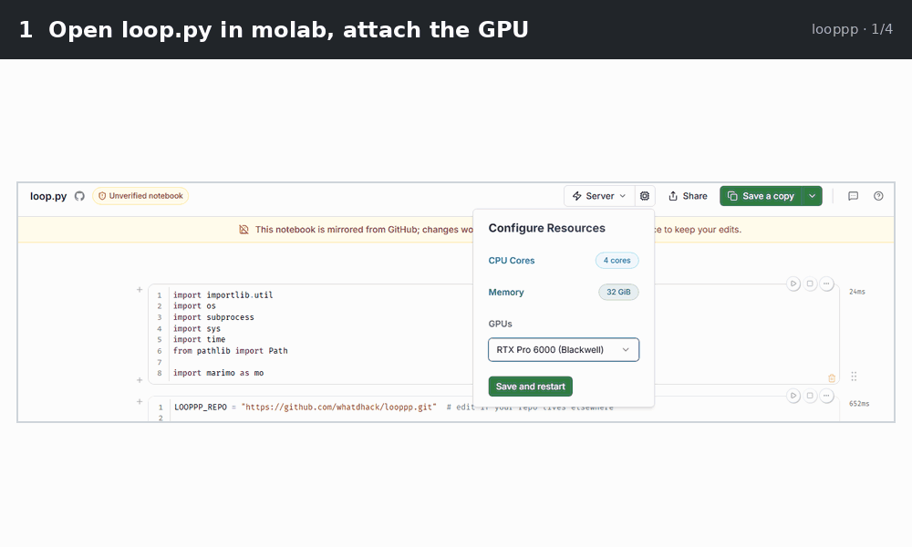
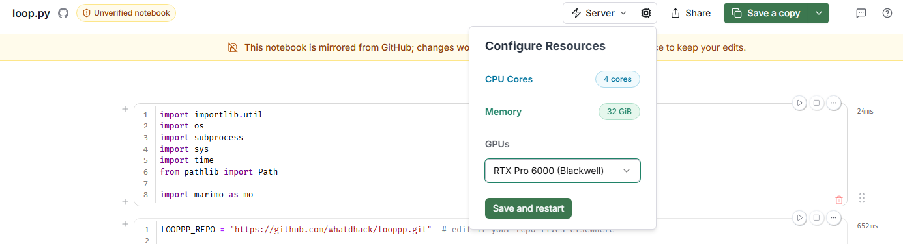
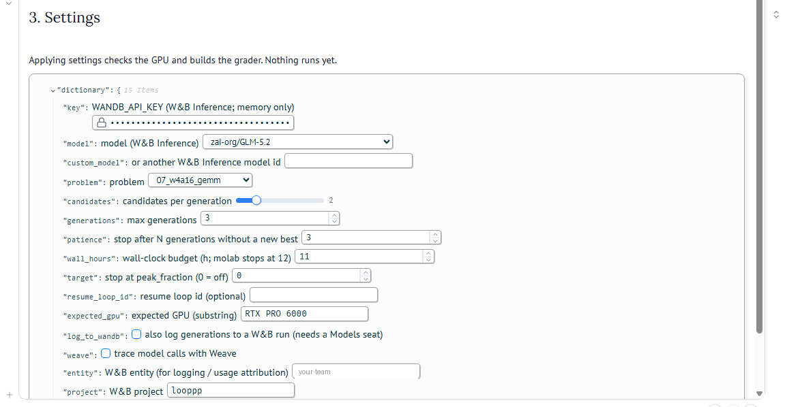
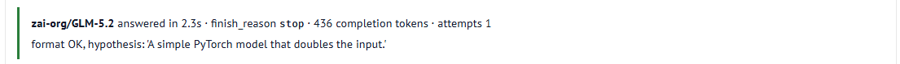
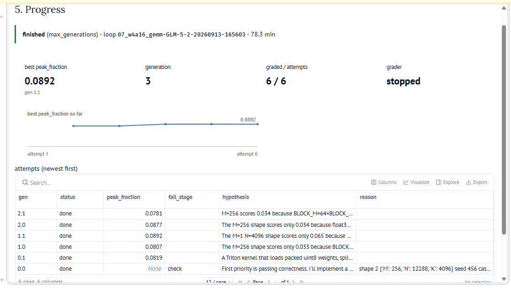
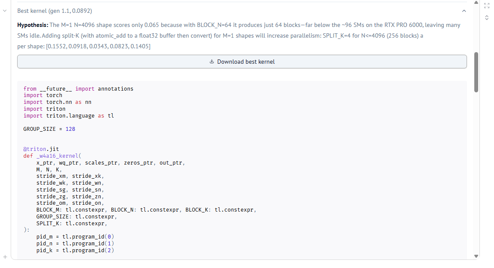
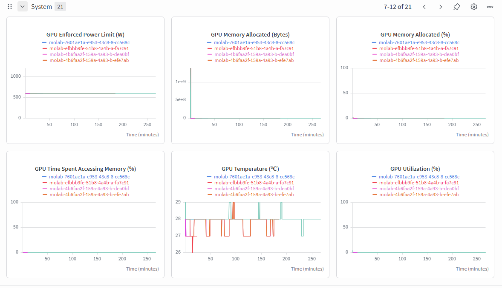
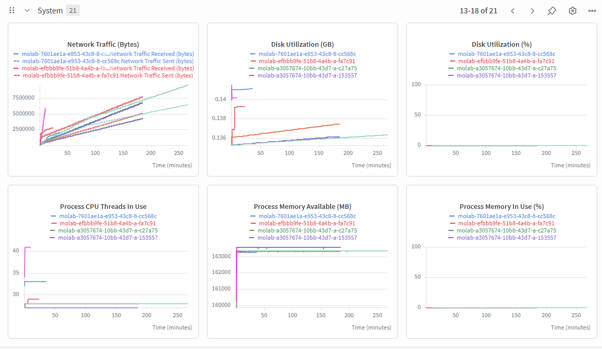
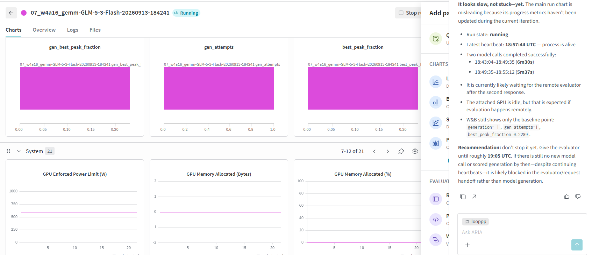

# looppp

An LLM agent loop that writes GPU kernels and grades them on a real **RTX PRO 6000 Blackwell** in
[molab](https://molab.marimo.io). The model comes from [W&B Inference](https://docs.wandb.ai/inference).
Problems come from the [KernelBench-Hard](https://github.com/Infatoshi/kernelbench.com) RTX PRO 6000 deck,
pinned to one commit, so scores can be compared with its published leaderboard (after calibration).

Each generation:

```
build prompt (task, reference.py, shapes, parent kernel, graded history, failure logs)
  -> model writes N candidate solution.py files          (W&B Inference)
  -> local precheck (syntax, Model class, forbidden ops)
  -> grader: restore deck from git, drop in solution.py,
     check.py (correctness + stress), benchmark.py (score)  (RTX PRO 6000)
  -> results fed back; best kernels become parents; improvements archived
  -> stop rules (generations, patience, time budget, target)
```

The score is KernelBench's `peak_fraction`: the geometric mean over shapes of the fraction of the GPU's
hardware ceiling (higher is better).

## Choose a mode

| | **Single notebook** (recommended) | **Distributed** |
|---|---|---|
| Open | [](https://molab.marimo.io/github/whatdhack/looppp/blob/main/notebooks/loop.py) `notebooks/loop.py` | [](https://molab.marimo.io/github/whatdhack/looppp/blob/main/worker/evaluator.py) `worker/evaluator.py` + `looppp run` on WSL |
| Agent loop runs | in the molab notebook (thread) | on WSL |
| Grader runs | in the same notebook (thread) | in the molab notebook |
| Queue between them | local files on the molab disk | W&B runs |
| W&B needed for | the model API only (logging and Weave optional) | model API, queue, heartbeats: needs a **Full Models seat** |
| If the molab tab/kernel dies | the loop stops too; resume later by loop id | the WSL loop pauses, alerts you, resumes when a worker is back |
| Analyse with ARIA | only if "log to W&B" is on (per-generation metrics) | every candidate is a W&B run |

Both modes use the same agent, grader, prompts and safety checks.

---

## Quick start: single notebook

**You need:** a molab account and a W&B API key. A W&B team entity is optional (usage attribution, logging).



<sub>Regenerate after replacing screenshots: `uv run --with pillow python docs/make_tour_gif.py`</sub>

1. **Open** [`notebooks/loop.py` in molab](https://molab.marimo.io/github/whatdhack/looppp/blob/main/notebooks/loop.py)
   and attach the **RTX PRO 6000** (resources button in the header → GPUs → *Save and restart*). Run all cells.

   

2. **Setup cell:** clones or pulls the looppp code and installs missing packages.
3. **1. Environment and problems:** all required checks must be green; the pinned deck is fetched.
4. **2. CUDA toolkit:** installs `nvcc` and headers automatically (about a minute on the first run). Needed
   for C++/CUDA extension kernels; Triton kernels work without it.
5. **3. Settings:** paste the W&B API key, choose model and problem, press **Apply settings**. This checks
   the GPU and builds the grader; nothing runs yet. Then press **Test the model** to send one small request.

   <details><summary>Settings form</summary>

   

   </details>

   A successful model test:

   

6. **4. Run:** **Start loop**. Keep the tab open. **Stop loop** takes effect after the current model call
   or grading.
7. **5. Progress** (auto-refresh): status and "Now: …" activity, best score, minutes per generation and how
   many more generations fit in the budget, a best-so-far chart, the attempts table, the log, and the best
   kernel with a **Download** button.

   

   <sub>First real run (GLM-5.2, 2 candidates × 3 generations, 78 min). Screenshot taken before the pace
   tiles, "Now:" line and mode/timing columns were added.</sub>

   <details><summary>Best kernel with download</summary>

   

   </details>

**Recommended first settings**

| Setting | Value | Why |
|---|---|---|
| model / problem | `zai-org/GLM-5.2` / `07_w4a16_gemm` | tested end to end |
| candidates per generation | 3 | one refines the best kernel, the others explore |
| max generations | 10 | check the pace after 2-3 generations, then size longer runs |
| patience | 6 | must be above "explore after", or the loop stops before exploring |
| explore after | 2 | switch to new designs after 2 generations without a 5% gain |
| parents | 2 | rotate between the two best kernels |
| start from | reference.py | the model alone; see [start from a published kernel](#search-behaviour) |

**Restarts and limits**

- molab stops sessions after 12 h (the default time budget is 11 h) and may stop idle notebooks. The loop
  lives in the kernel, so it stops with the session.
- After a kernel restart the settings form is empty: re-enter the key. New looppp code is only picked up
  after a restart.
- To continue a stopped loop, put its loop id in **resume loop id**. This works if molab kept the notebook's
  disk (`~/looppp/.looppp/session`). Candidates that were submitted but not graded are graded first.
- To calibrate the GPU against KernelBench, use the evaluator notebook (section 4) or `looppp calibrate`;
  see [Calibration](#calibration-and-comparing-scores).

---

## Quick start: distributed

**You need:** WSL (or any Linux) with [uv](https://docs.astral.sh/uv/), a molab account, and a W&B API key
whose user has a **Full Models seat** in the team entity.

### 1. WSL: install and check

```bash
cd ~/ai26/looppp
uv sync
cp .env.example .env            # fill WANDB_API_KEY and WANDB_ENTITY (a team)
uv run pytest -q                # offline: fake deck, fake worker, stub model
uv run looppp fetch-deck        # shallow sparse clone of the pinned deck into .looppp/deck
```

### 2. Dry run with no GPU and no model

Two terminals:

```bash
uv run looppp worker --backend local --fake              # terminal A: CPU fake grader
uv run looppp run --backend local --stub-llm --max-generations 2 --candidates 2 --poll-seconds 1
```

### 3. Check the real services

```bash
uv run looppp smoke-llm --model zai-org/GLM-5.2          # reply format, tokens, finish_reason
uv run looppp smoke-queue --backend wandb                # W&B round trip in project looppp-smoke
```

Run `smoke-llm` for every model you plan to use: reasoning models can return empty replies until
`max_tokens` is raised (`configs/models.yaml`).

### 4. molab evaluator (manual start, at most 12 h per session)

1. Open [`worker/evaluator.py` in molab](https://molab.marimo.io/github/whatdhack/looppp/blob/main/worker/evaluator.py)
   and attach the RTX PRO 6000.
2. **1. Environment** must be green. **2. KernelBench deck** fetches the problems.
   **2b. CUDA toolkit** installs automatically.
3. **3. Connect:** paste a W&B service-account key and the team entity. The connection report checks W&B
   read and write access, the deck, the GPU and the CUDA toolkit.
4. **4. Calibrate** (once per session): see [Calibration](#calibration-and-comparing-scores).
5. **5. Worker → Start worker.** Keep the tab open.

### 5. Real loop on WSL

```bash
uv run looppp run --problem 07_w4a16_gemm --model zai-org/GLM-5.2
uv run looppp status                          # worker heartbeat + recent candidates
uv run looppp run --loop-id <id>              # resume after a crash or restart
```

If the worker heartbeat goes stale, the loop **pauses** (no model spend), sends a W&B alert, and resumes
when a worker is back. After `queue.max_worker_down_hours` it stops with `worker_down`.

---

## Search behaviour

Configured under `loop:` in `configs/run.yaml`; the single notebook exposes the same settings.

- **Parents:** candidates rotate over the `parents_top_k` best distinct graded kernels, not only the best one.
- **Explore:** after `explore_after` generations without a `min_rel_improvement` (5%) gain, one candidate per
  generation keeps refining the best kernel and the others must try a structurally different design
  (algorithm or data layout, per-shape strategy, precision, Triton vs a C++/CUDA extension). The prompt lists
  every approach already tried with its outcome. Parameter-only changes don't count as exploring.
- **Feedback:** each prompt carries the parent kernel with its per-shape scores, the recent graded attempts,
  and the evaluator logs of the previous generation's failures.
- **Repairs:** a candidate rejected by the local precheck is sent back once with the errors
  (`precheck_repairs`).
- **Model call failures:** one failed call costs one candidate; three in a row stop the loop.
- **Start from a published kernel** (single notebook setting): grades a KernelBench-published kernel first
  (row `seed`) and uses it as the starting parent. It is never archived, because the result is no longer the
  model alone.
- **Stop rules:** `max_generations`, `patience` (generations without any new best), `wall_budget_hours`,
  `target_peak_fraction`, a Stop button (notebook), and `worker_down` (distributed).

## Reading results

Attempts table columns (single notebook):

| Column | Meaning |
|---|---|
| `gen` | `generation.index`; `seed` for a starting kernel |
| `mode` | `exploit` (refine a parent), `explore` (new design), `seed` |
| `status` | `pending` / `running` / `done`; `local_failed` = rejected before grading |
| `peak_fraction` | score, only when check.py passed and benchmark.py produced a complete result |
| `fail_stage` | why it has no score (below) |
| `model_s` / `grade_s` / `total_min` | model time, grading time, wall time for the candidate |

`fail_stage` values:

| Stage | Meaning |
|---|---|
| `llm` | model call failed or returned nothing usable |
| `precheck` | syntax error, no `Model` class, forbidden op, or an exit call (never graded) |
| `duplicate` | identical code already graded |
| `import` | solution.py failed to import or compile |
| `forbidden` | check.py found a forbidden op |
| `check` | wrong results (see the reason: shape, seed, stress case, error size) |
| `benchmark` | benchmark.py failed or its score lines were incomplete |
| `timeout` | check or benchmark exceeded its timeout (30 min each) |
| `toolchain` | the kernel builds a C++/CUDA extension but no CUDA toolkit is available |
| `tamper` | grader files changed during grading |
| `submit`, `download`, `integrity`, `worker_lost`, `worker_exception` | infrastructure problems |

The best graded kernel per problem is written to `archive/<problem>/best.py` + `best.json` when it beats the
archived score for the same deck commit (`archive.git_commit: true` commits just those files). Dry runs
(`--stub-llm`) write to `.looppp/archive-dryrun/`.

## Calibration and comparing scores

A molab GPU is not KernelBench's GPU. Calibration grades a kernel KernelBench published for a run (the exact
file behind the published score, `public/runs/<run_id>_solution.py.txt` at the pinned commit) several times,
compares the mean with the published score, and shows a per-shape table with a diagnosis:

- a **uniform** gap across shapes points at GPU throughput (power limit, variant, versions);
- a gap concentrated on the **fastest calls** points at CPU / kernel-launch overhead (molab notebooks have
  4 shared CPUs).

| Target | Problem | Published | Kind |
|---|---|---|---|
| `w4a16-triton-fable-5` | 07_w4a16_gemm | 0.2608 | Triton |
| `paged-attention-triton-opus-4-8` | 03_paged_attention | 0.6706 | Triton |
| `w4a16-cuda-kinetic-0715` | 07_w4a16_gemm | 0.3733 | C++/CUDA (needs toolkit) |
| `w4a16-cuda-deepseek-v4-pro` | 07_w4a16_gemm | 0.3103 | C++/CUDA (needs toolkit) |

First measurement on molab: `w4a16-triton-fable-5` scored 0.2244 (0.223-0.226 over 3 runs), a ratio of
**0.86**. Compare looppp scores with each other; divide by the calibration ratio only for a rough
leaderboard-equivalent number. Run calibration from the evaluator notebook (section 4) or with
`looppp calibrate --target NAME` on a GPU box.

## CUDA toolkit

molab's torch ships the CUDA runtime but not `nvcc`, so C++/CUDA extension kernels (`torch.utils.cpp_extension`,
used by most top KernelBench solutions) need a toolkit. looppp provides one without touching torch:

- it finds an existing toolkit first (`$CUDA_HOME`, `nvcc` on PATH, `/usr/local/cuda`, or one it built earlier);
- otherwise it pip-installs only the compiler wheels (`nvcc`, `crt`, `nvvm`) with `--no-deps`, at the newest
  release in torch's CUDA major version, and the runtime headers only if missing;
- it searches every `site-packages/nvidia` on the Python path (molab splits them between a venv and the
  system site-packages) and assembles a symlink `CUDA_HOME` (`bin`, `nvvm`, `include`, `lib64`);
- it compiles and links a test kernel, and upgrades the compiler once if an older minor version fails against
  the host glibc (CUDA 13.0 does on glibc 2.43).

The grader looks the toolkit up at every grading and passes `CUDA_HOME` to the grading process.
CLI: `looppp cuda-toolkit`.

## Commands

| Command | Mode | Where | What |
|---|---|---|---|
| `looppp run` | distributed | WSL | Agent loop (`--stub-llm` dry runs, `--loop-id` resume) |
| `looppp worker` | distributed | GPU box / any with `--fake` | Grader loop outside the notebook |
| `looppp status` | distributed | anywhere | Worker heartbeat age and recent candidates |
| `looppp smoke-queue` | distributed | anywhere | Queue round trip in a throwaway project |
| `looppp smoke-llm --model M` | both | anywhere | One small W&B Inference request |
| `looppp fetch-deck` | both | anywhere | Pinned KernelBench deck |
| `looppp calibrate --target NAME` | both | GPU box | Grade a published kernel against its published score |
| `looppp cuda-toolkit` | both | GPU box | Find or install nvcc + headers, assemble `CUDA_HOME` |
| `looppp trace-solution RUN_ID -o f.py` | both | anywhere | Published solution.py of a run (`--replay` rebuilds it from the HF trace) |
| `looppp env` | both | GPU box | Environment report |

## Configuration

- `configs/run.yaml`
  - `loop`: problem, model, candidates per generation, stop rules, history window, repairs, `parents_top_k`,
    `explore_after`, `min_rel_improvement`
  - `queue`: backend (`wandb` / `local`), entity, project, polling, timeouts, heartbeat (distributed mode)
  - `deck`: KernelBench repo and pinned commit
  - `archive`, `worker` (expected GPU, check/benchmark timeouts), `calibration` targets
- `configs/models.yaml`: W&B Inference model ids with `max_tokens`, `max_tokens_cap`, `temperature`,
  `extra_body`. Empty or truncated replies are retried with a doubled `max_tokens` up to the cap.

The single notebook overrides the loop settings from its form.

## Weave (optional)

Weave is only used to **trace model calls**. When enabled, `weave.init("<entity>/<project>")` runs before the
W&B Inference client is created, and Weave's OpenAI integration then records every chat completion (prompt,
reply, token counts, latency) in that Weave project. Nothing else is traced: prechecks, grading and scores are
not Weave ops.

| Mode | How to enable |
|---|---|
| Single notebook | tick **trace model calls with Weave** in Settings (entity and project required; weave is installed on demand) |
| Distributed | on by default for `looppp run` with the W&B backend and `WANDB_ENTITY` set; `--no-weave` turns it off |

Candidate results live in the attempts table (notebook) or in W&B runs (distributed), not in Weave.

## W&B layout (distributed mode)

Every **candidate** is one W&B run: `job_type=candidate`, `group=<loop_id>` (contract:
`src/looppp/contract.py`).

| Where | Fields |
|---|---|
| `config` (agent, immutable) | `kind`, `problem`, `deck_commit`, `loop_id`, `generation`, `index`, `model`, `hypothesis`, `code_sha256`, `parent`, `mode` |
| file | `solution.py` |
| `summary` (worker) | `status` (`submitting → pending → running → done / error / abandoned`), `attempts`, `correct`, `peak_fraction`, `shape_fractions`, `fail_stage`, `fail_reason`, `check_tail`, `bench_tail`, `grade_seconds`, `gpu_name`, `torch_version`, `worker_id` |

A **worker** run (`job_type=worker`) logs `heartbeat_ts`, its GPU / toolkit description and calibration
results. An **agent** run (`job_type=agent`, one per loop) logs per-generation best, failure counts, explore
counts and token usage, and sends alerts. The single notebook creates only the agent run, and only when
"log to W&B" is ticked.

W&B also records **system metrics** for every run (the *System* section of the workspace). For the molab worker
runs these show the GPU (power limit, memory, temperature, utilisation), network, disk and process memory.
They are W&B Models metrics, not Weave.

<details><summary>System metrics of molab worker runs</summary>





These worker sessions were mostly idle (utilisation near 0%, apart from calibration at the start). The flat
600 W enforced power limit is the full RTX PRO 6000 limit, so a power cap does not explain the 0.86
calibration ratio.

</details>

### ARIA

[ARIA](https://docs.wandb.ai/aria/overview) (W&B's research agent, *Ask ARIA* in a team project) can read the
W&B runs looppp creates and answer questions about them. In the single notebook this needs **log generations to
a W&B run** ticked.

<details><summary>Asking ARIA about a running single-notebook loop</summary>



ARIA only knows what is logged. The agent run records metrics when a generation finishes, so while the first
generation is still in progress it sees just the starting kernel (`generation=-1`). Here it assumed a remote
evaluator; in the single notebook the grader runs on the same GPU, which is idle while the model writes
candidates.

</details>

## Safety

Candidates are untrusted LLM-written code running next to your W&B key.

- **Key handling (molab):** typed into a password field; never written to disk or molab secrets, and passed
  explicitly to the SDKs (no `wandb.login`, no `~/.netrc`). Exception: ticking "trace with Weave" in the
  single notebook puts the key in the kernel's environment, because Weave reads it from there.
- **Grading processes** get an environment with every secret-looking variable removed, run in their own
  process group with timeouts, and use per-candidate Triton and extension caches.
- **Tamper checks:** the deck is restored from git before and after every candidate; any change to tracked
  grader files fails the run (`tamper`).
- **Score integrity:** a score needs exactly one marker per shape (0..n-1) and exactly one `peak_fraction:`
  line. Extra markers printed by the candidate make the run unscored.
- **Key scope:** use a W&B service-account key limited to the looppp team where possible.

These close the easy paths. They are not a sandbox: in-process monkeypatching of timing code is still
possible. Read the code of a suspiciously high score before trusting it, as KernelBench does.

## Development

```bash
uv run pytest -q                              # offline: fake deck git repo, fake grader, stub model
uv run marimo check notebooks/loop.py worker/evaluator.py
uv run marimo edit notebooks/loop.py          # local editing (no GPU: env checks fail, the rest works)
```

```
configs/            run.yaml, models.yaml
src/looppp/
  agent.py          the loop: parents, explore, propose, precheck, submit, wait, archive, stop
  session.py        single-notebook mode: agent thread + grader thread + local queue, snapshot for the UI
  prompts.py        system prompt, exploit/explore context, repair messages
  llm.py            W&B Inference client (empty/truncated reply retries), StubLLM
  precheck.py       CPU-side syntax / interface / forbidden-op checks
  parsing.py        check.py / benchmark.py / model reply parsers (fail closed)
  grade.py          KernelBenchGrader (subprocess, scrubbed env, tamper checks, toolkit), FakeGrader
  worker.py         claim-grade-report loop with heartbeat thread; calibration with per-shape diagnosis
  queue/            base protocol, local (files), wandb_queue
  contract.py       shared schema (statuses, fail stages, CandidateSpec, GradeResult)
  cudatk.py         CUDA toolkit discovery / pip provisioning / CUDA_HOME assembly
  envcheck.py       environment report, GPU probe (nvidia-smi / torch / procfs)
  traces.py         published kernels, KernelBench run details, HF trace replay
  problems.py       pinned deck fetch + problem loading
  tracker.py        console / W&B / tee trackers
  archive.py        best-per-problem archive
  config.py         typed config loading
  cli.py            `looppp` commands
notebooks/loop.py   single notebook: loop + grader in molab
worker/evaluator.py distributed mode: grader-only notebook (with calibration)
tests/              offline tests
```

## Known limits

- **molab behaviour** that isn't documented: whether a busy notebook counts as idle for the 90-minute
  shutdown, and whether closing the tab stops the kernel. Keep the tab open during runs.
- **Grading is slow and one candidate at a time:** check.py plus benchmark.py, with Triton autotuning or an
  extension build on 4 CPUs, takes minutes per candidate. Use the pace numbers to size runs.
- **Distributed mode:** one worker per W&B project (claiming is read-then-write, not atomic), and freshly
  submitted candidates can take a few seconds to appear in W&B queries.
- **Repo URL:** both notebooks clone `https://github.com/whatdhack/looppp.git` when opened outside a checkout.
  Edit `LOOPPP_REPO` at the top of the notebook if the repo lives elsewhere.

Third-party material and licenses: [third_party/NOTICE.md](third_party/NOTICE.md).
